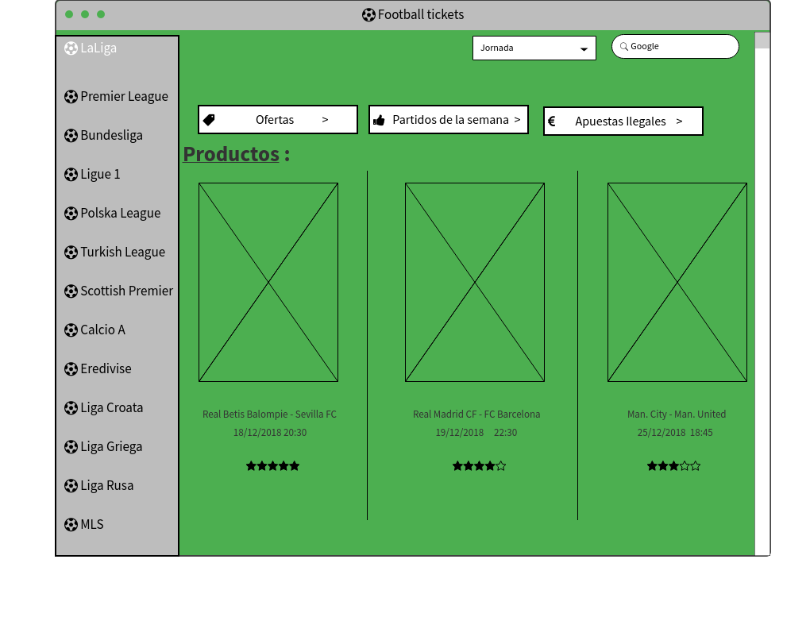

# FootballTickets

_Integrantes del grupo:_

- Antonio Galán Ramírez

- Victorino Blázquez Feria

- Jose Manuel Ramos Domínguez

  ​

 **Introdución de la aplicación :**

La aplicación que vamos a desarrollar consiste en un comparador de precios de entradas de fútbol a nivel europeo.  

El usuario entrará en la aplicación y a traves de un buscador, en el cual se selecionará previamente liga, partido y horario la aplicación mostrará una lista de resultados en el cual el usuario podra escoger de entre varias opciones mostradas en pantalla, la entrada que más le convenga tanto por localidad o por precio, pudiendo comparar el distinto precio de la entradas con respecto a la posición de la localidad.

*__Herramientas Usadas :__*

- **MockFlow :** Con dicha herramienta hemos creado el mockup y hemos diseñado la página inicial de nuestra aplicación web, hemos cogido dicha herramienta por ser bastante intituiva, fácil de usar y tener gran variedad de opciones para la creación de aplicaciones web.

- **Typora :** Con dicha herramienta hemos documentado el trabajo que hemos ido realizando para poder guardarlo en un archivo md, hemos elegido esta herramienta de trabajo ya que ofrece grandes alternativas a la hora de documentar y ofrece mayor fluidez y rapidez que otras aplicaciones con el mismo fin.

  ​

**Descripción del mockup**: En la imagen de previsualización del ***mockup*** podemos ver como quedaría su diseño de la página principal, donde en la parte superior se muestran las diferentes ligas de fútbol que podremos escoger. También podemos diferenciar en la imagen las 6 secciones siguientes:

| SECCIÓN                             | DESCRIPCIÓN                                                  |
| ----------------------------------- | ------------------------------------------------------------ |
| **Formulario de LOG-IN**            | Se sitúa en la parte izquierda de la aplicación, aquí el usuario podrá loguearse (***Iniciar sesión***) con sus datos personales en la página de *FootballTickets.* |
| **Formulario de registro**          | Se sitúa al igual que el **Formulario de LOG-IN** en la parte izquierda, aquí el usuario podrá registrarse en la página de *FootballTickets*. |
| **Barra de búsqueda**               | Se encuentra debajo de las opciones de selección de las*Ligas de Fútbol* y aquí el usuario podrá encontrar mediante palabras clave, su entrada. |
| **Ventana "*Partidos de hoy*"**     | Se sitúa en la parte central de la aplicación y se mostrará la lista de partidos disponibles para adquirir tu entrada, esta ventana irá actualizando la lista de partidos conforme finalicen y empiecen estos en el '***día de hoy***'. |
| **Ventana "*Entradas más barata*"** | Se sitúa en la parte central inferior de la aplicación y muestra las entradas más baratas disponibles para los próximos partidos. |
| **Ventana "*Próximos partidos*"**   | Se sitúa en la parte derecha de la aplicación y lista los partidos que se van a disputar en fechas posteriores al '***día de hoy***' |

- #### **Formulario de la aplicación**

------

| SECCIÓN               | DESCRIPCIÓN                                                  |
| --------------------- | ------------------------------------------------------------ |
| **Usuario nuevo**     | Es la ventana donde el usuario realizará su registro en la aplicación. |
| **Google o Facebook** | En esta ventana el usuario puede registrarse en la aplicación a través de estas dos plataformas. |
| **¿Ya eres usuario?** | En esta otra ventana el usuario de la aplicación puede loguearse (***Iniciar Sesión***) en la aplicación. |

- #### **Página del perfil de usuario**

------

| SECCIÓN                | DESCRIPCIÓN                                                  |
| ---------------------- | ------------------------------------------------------------ |
| **Foto**               | El usuario podrá poner una imagen que represente su perfil de *usuario* en la aplicación. |
| **Datos del perfil**   | Aquí se detallarán los *Datos personales* del *usuario* que hará uso de la aplicación. |
| **Entradas compradas** | Muestra el registro de las últimas *Entradas* compradas por el *usuario*. |
| **Fotos**              | Esta ventana muestra las fotos subidas por el usuario de su experiencia en los estadios en la compra de sus entradas. |
| **Comentarios**        | Guarda los comentarios realizados por el usuario en la compra de entradas y su valoración de la compra. |
| **Contacto**           | Aquí se muestra los datos del *usuario* para poder contactar con él. |

- #### **Datos importantes de la aplicación**

****

| SECCIÓN                           | DESCRIPCIÓN                                                  |
| --------------------------------- | ------------------------------------------------------------ |
| **Ventana de ligas**              | Se sitúa a la izquierda de la página y el usuario podrá seleccionar la ***Liga*** en la que desea comprar la entrada. |
| **Ventana de productos**          | Abarca la mayor parte de la página y en ella encontraremos las **entradas de fútbol** (*productos*) que se encuentran activas para su compra de los partidos disponibles en cada ***Liga***. |
| **Ventana ofertas**               | Actúa como filtro de la página para poder ver con rapidez las ofertas disponibles en el precio de las entradas en cada ***Liga***. |
| **Ventana partidos de la semana** | Actúa como filtro y muestra los partidos con mayor valoración disponibles cada semana. |

- #### **Entidad importante de nuestra aplicación**

------

| SECCIÓN                            | DESCRIPCIÓN                                                  |
| ---------------------------------- | ------------------------------------------------------------ |
| **Ventana ('*Próximos eventos'*)** | Se mostrarán los **partidos** con su fecha y horario que se van a disputar en las siguientes *Jornadas* y el **estadio** donde se celebrarán estos. |
| **Ventana *'Jornada'***            | Mostrará un listado con los partidos correspondientes a la *Jornada* actual semanal. |
| **Ventana *'Jornada'* inferior**   | El usuario podrá comprobar y seleccionar su *Localidad* a su gusto comparando su precio dependiendo de su ubicación en el estadio. |
| **Ventana cantidad de entradas**   | El usuario podrá seleccionar la cantidad de *entradas* que desea comprar. |
| **Botón de compra**                | ***"Buy tickets"*** será el botón que confirme la compra de las entradas. |

- #### **Página adicional**

------

| SECCIÓN                      | DESCRIPCIÓN                                                  |
| ---------------------------- | ------------------------------------------------------------ |
| **Ventana FAQ**              | Mostrará las ***preguntas frecuentes*** que suelen realizar los usuarios en y sobre la aplicación. |
| **Ventana reclamaciones**    | El *usuario* podrá alegar alguna **queja** que tenga contra o sobre la página de la aplicación. |
| **Ventana sugerencias**      | El usuario de la ***app*** podrá sugerir sobre que cambios podríamos hacer esta ya sea para un mejor rendimiento, algún cambio para una mejor visualización,etc. |
| **Ventana de ayuda**         | Aquí el usuario puede consultar directrices sobre como usar la ***app*** o consultar a nuestros *consultores online* sobre cualquier duda. |
| **De valoración**            | Se podrá valorar el nivel de prestación de la aplicación.    |
| **Ventana datos de interés** | Se mostrará información personal de la empresa para mantener un buen contacto con los usuarios. |

## Diagramas UML

En este diagrama de clases aparecen las clases que tiene nuestra pagina Web. Se distinguen las siguientes clases, de las que explicaremos sus atributos y métodos a continuación:

​	-**Entrada**: Tiene como atributos los datos principales que cualquier entrada debe tener(precio, sitio, 		estado, fecha). También tiene como atributo un Usuario que será el poseedor de dicha entrada. Los métodos de clases cambian el atributo de estado de la entrada en caso de que un usuario compra,venda o reserve una entrada.

​	-**Partido**: Un partido tiene como atributos las entradas disponibles para ese partido, así como la fecha y la liga. Los métodos de esta clase nos permiten ocupar o liberar un asiento en función de si compramos o vendemos nuestra entrada. En caso de reserva, el asiento de esa entrada será ocupado.

​	-**Usuario**: El usuario tiene como atributos su nombre y apellidos, su dni, su edad y una lista de entradas compradas. El usuario podrá compra o vender entradas serán añadidas o borradas de su lista de entradas. La opción de reserva se comtempla como una compra sin confirmación. 

### Diagramas de objeto

**ENTRADA**

.jpeg)

**PARTIDO**

.jpeg)

**USUARIO**

.jpeg)

**Bibliografía :**

[MockFlow](https://www.mockflow.com/)

[Typora](https://typora.io/)

[Guia Typora 1](https://markdown.es/sintaxis-markdown/#citas)

[Guia Typora 2](http://fobos.inf.um.es/R/taller5j/30-markdown/guiabreve.pdf)

[Guía Typora 3](http://joedicastro.com/pages/markdown.html#mark2)

[Lucidchart](https://www.lucidchart.com)

